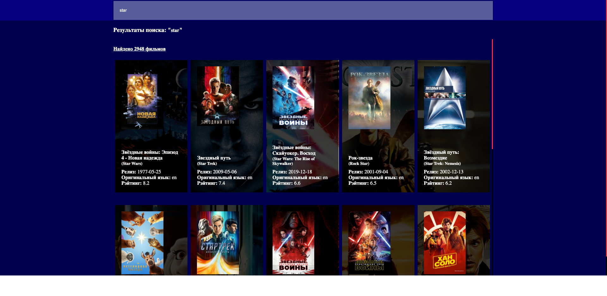

# MovieSearch
### Супер - пупер проект для поиска фильмов по базе The Movie DB

Цель проекта: научиться использовать хуки в реакт плюс работа с анимацией.

## Скриншоты

>
> <kbd></kbd>
> <kbd></kbd>
>

## Изменения

- Перешел с React на Preact
- Обновил зависимости
- Упростил сборку

## Онлайн демо
Короче все [сюда](https://vicimpa.github.io/moviesearch)

## Для запуска в режиме отладки
```bash
> make install
> make start-dev
```

## Для запуска в режиме продакшен
```bash
> make install
> make build
> make start
```

## Для запуска билда в режиме отладки
```bash
> make install
> make build-dev
```
